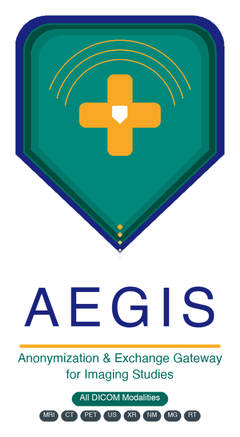
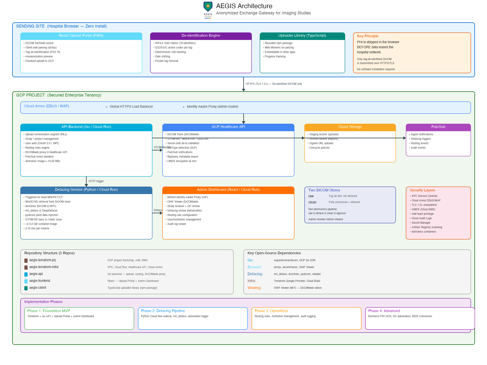

# AEGIS

**Anonymization & Exchange Gateway for Imaging Studies**

A GCP-hosted platform for secure, HIPAA-compliant sharing of medical imaging data (all DICOM modalities) between hospitals, universities, and research institutions.

The name carries a double meaning. As an acronym it describes exactly what the system does — an **A**nonymization & **E**xchange **G**ateway for **I**maging **S**tudies. As a word it comes from Greek mythology: the *aegis* was the divine shield of Zeus and Athena, a symbol of protection. That duality captures the platform's core mission — shielding patient identity while enabling the free flow of medical imaging data for research and clinical care.

## What It Does

- **Browser-based anonymization** — DICOM tag-level de-identification happens in the browser before data leaves the hospital network. No software installation required. Works with any DICOM modality.
- **Internal enterprise ingress** — Studies originating inside the enterprise can be ingested directly into the enterprise GCP tenancy and routed through the same anonymization/QC pipeline.
- **Server-side defacing** — Automated facial feature removal from 3D head scans after upload. Non-head modalities bypass defacing automatically.
- **Secure cloud routing** — Encrypted transmission to a GCP Healthcare API DICOM store with DICOMweb endpoints.
- **Admin review** — OHIF-powered viewer for QC, defacing review, and study management.
- **Controlled external sharing** — After approval, processed studies can be shared with external partners through policy-controlled export/download paths.
- **Modality-agnostic** — Supports MRI, CT, PET, PET/CT, ultrasound, X-ray, nuclear medicine, mammography, and all other DICOM-compliant imaging. MVP focuses on brain MRI/PET/CT.

## Architecture

See [AEGIS_Architecture.md](AEGIS_Architecture.md) for the full system design.

For signed upload setup details, see [GCP_UPLOAD_NOTES.md](GCP_UPLOAD_NOTES.md).

## Repositories

| Repo | Description |
|------|-------------|
| `aegis-terraform-prj` | GCP project bootstrap (IAM, KMS, VPC-SC) |
| `aegis-terraform-infra` | Infrastructure (Cloud Run, Healthcare API, Cloud Armor) |
| `aegis-api` | Go backend — upload orchestration, routing, DICOMweb proxy |
| `aegis-frontend` | React — Upload Portal + Admin Dashboard |
| `aegis-client` | TypeScript uploader library (npm package) |

## Tech Stack

- **Backend**: Go on Cloud Run (`distroless` containers)
- **Database**: Cloud SQL (PostgreSQL 15)
- **Frontend**: React + TypeScript
- **DICOM**: GCP Healthcare API (DICOMweb), dcmjs, dicomParser
- **Analytics**: BigQuery (DICOM metadata export, audit dashboards)
- **AI/ML**: Vertex AI (burned-in PHI detection, image QC)
- **Defacing**: mri_deface, dcm2niix, pydicom (Python Cloud Run sidecar)
- **Viewer**: OHIF Viewer
- **Infrastructure**: Terraform, Cloud Build

## License

*TBD*
